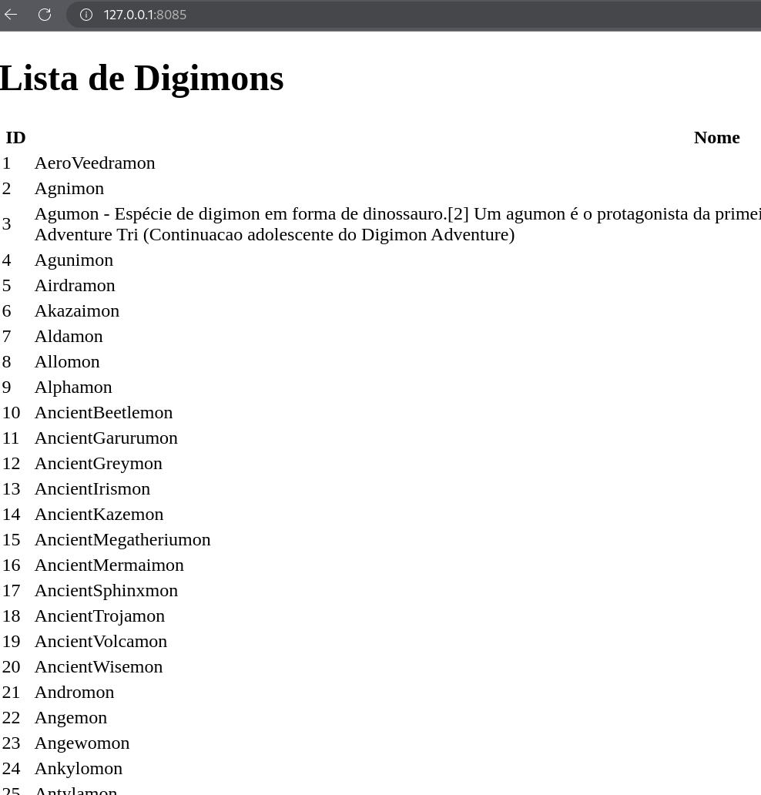

# kafkaProjects

Mini Projects to discover the `Kakfa` world using `chatGPT` guidance.

## Project 01 - Digimons Web Scraper

**Overview**

- The `Producer` is a `webscraper` service that is activated on demand. It retrieves the names of all digimons using `Selenium` and sends them to a `Kafka` topic.

- The `Consumer` will read each name and store it in a `SQLite` database.

- Lastly, a `Flask` web page displays all the data stored on a simple HTTP page.

---

To execute

1. Initiate the `kafka broker`
    - Create a `Kafka` topic called `digimons`

2. Create a database called `digimons.db`
    - You can also clear the current database with

        ```python _delete.py```

3. Install selenium drivers, check the [official docs](https://www.selenium.dev/documentation/webdriver/getting_started/install_drivers/#quick-reference)
    - Note: I used the Firefox driver.

4. Execute in order, and on different terminals
    - ```python 01_producer.py```
    - ```python 02_consumer.py```
    - ```python 03_activate_producer.py```
    - ```python 04_display_results.py```

5. If nothing went wrong, you can check the results at

    `http://127.0.0.1:8085/`


